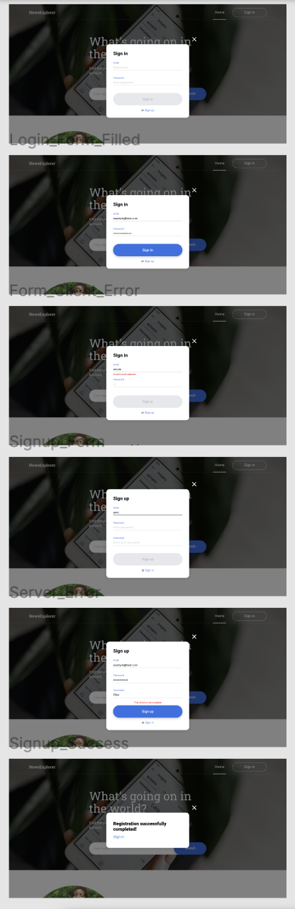
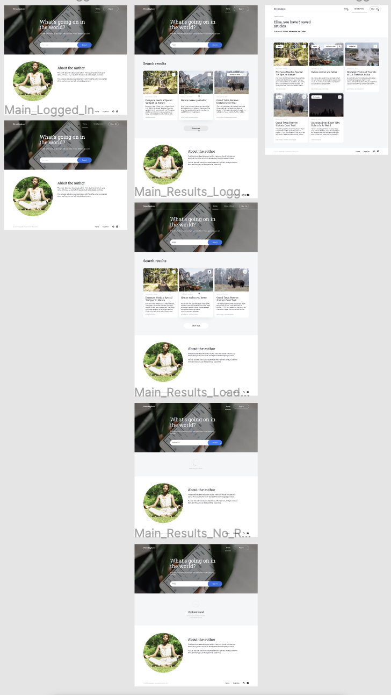
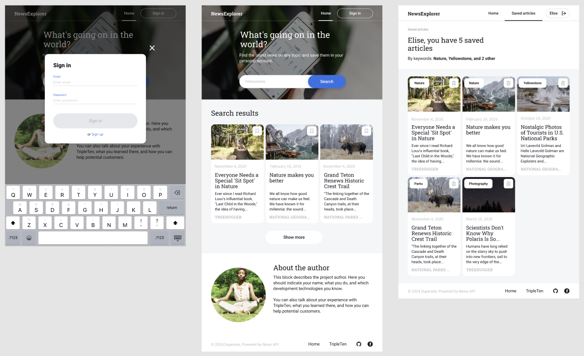
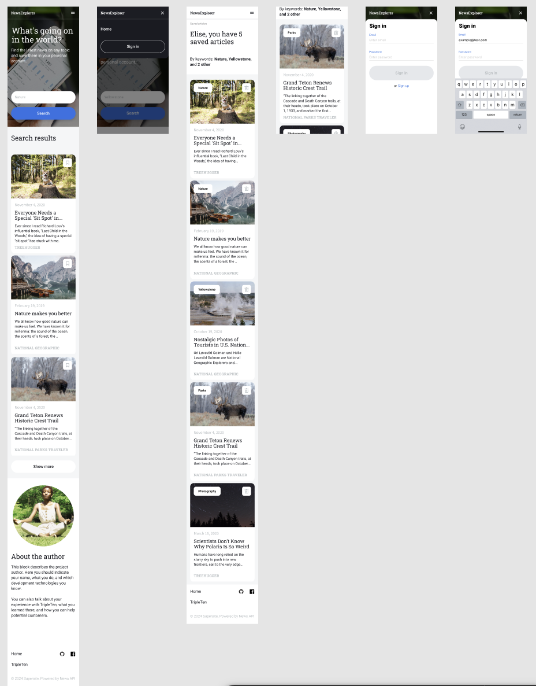

# NewsExplorer – Front-End Project

NewsExplorer is a React-based news search application that allows users to search live articles, view organized news cards, and save or delete articles to a personal profile. The project demonstrates asynchronous API interaction, state management with Redux, user authentication, and responsive front-end design.

# Live Demo:

https://luckygith.github.io/project_newsexplorer_frontend/

# Table of Contents

1. Overview
2. Project Features
3. Technologies Used
4. Implementation
5. Screenshots & UI Previews
6. Results
7. Future Improvements
8. Links & Resources

# Overview

NewsExplorer was built to demonstrate dynamic content rendering, user-specific functionality, and third-party API integration in a modern React environment.

Key objectives:

- Search and display live news articles based on user queries

- Allow users to save and manage favorite articles on a profile page

- Demonstrate state-based UI changes such as light/dark theming and responsive design

# Project Features

Live search-query API integration with

- NewsAPI
- Dynamic news cards showing:
- Article title
- Published date
- Description
- Source
- Image
- Save & delete article functionality for logged-in users
- Authorization and authentication with protected routes

Redux state management for:

- Page identifier
- API response organization
- Save/delete card actions
- Responsive design with:
- Desktop, tablet, and mobile breakpoints
- Hamburger menu for small screens
- Pre-deployment mode includes hardcoded API data simulation to demonstrate functionality without live API

# Technologies Used

React with Hooks

Redux for state management

Vite for fast React development and HMR

JavaScript (ES6+)

HTML5 & CSS3 (with responsive media queries)

Fetch API for asynchronous requests

Authorization and authentication logic

# Implementation

Built the initial React SPA structure with reusable components for headers, modals, and news cards. Integrated asynchronous fetch requests to NewsAPI for live articles.

Implemented Redux to manage:

API data and search results
Saved/deleted articles
Page and theme state

Created a responsive layout for desktop, tablet, and mobile devices.

Added authentication for saving/deleting articles and displaying profile-specific content.

Pre-deployment testing with hardcoded API simulation to ensure UI functionality before live API integration.

# Screenshots & UI Previews

# Results

Successfully implemented a news search and save platform with real-time API interaction.

Responsive and user-friendly UI across devices.

State-driven React + Redux architecture supporting authentication and dynamic content.

# Future Improvements

- Add infinite scroll or pagination for large news result sets
- Include user-specific keyword tags for saved articles
- Implement unit and integration testing
- Enhance loading states and error handling for API requests
- Deploy with custom domain and HTTPS for a fully professional production setup

# Links & Resources

Live Project: NewsExplorer on GitHub Pages
NewsAPI Source Documentation: https://newsapi.org/
